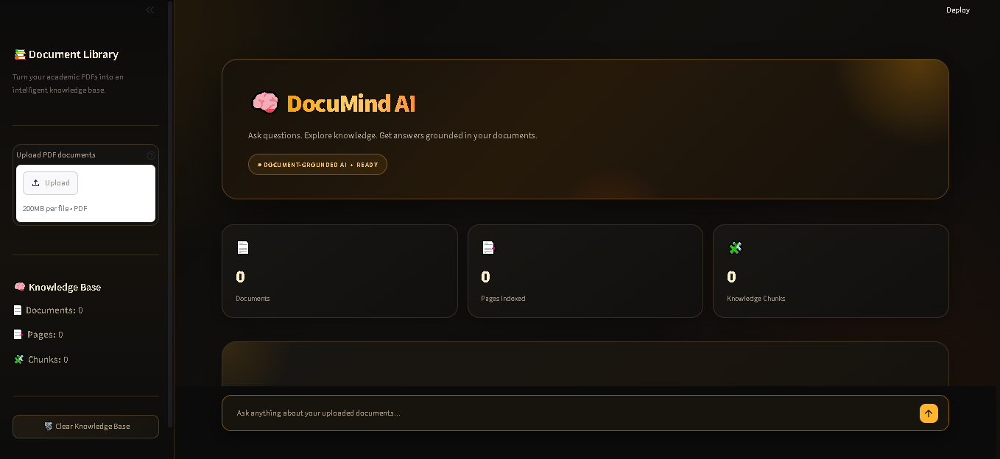
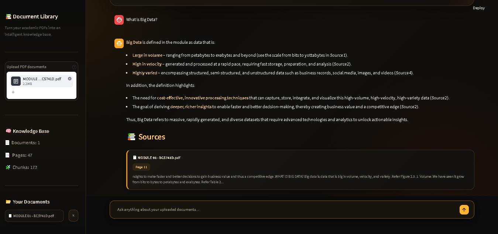
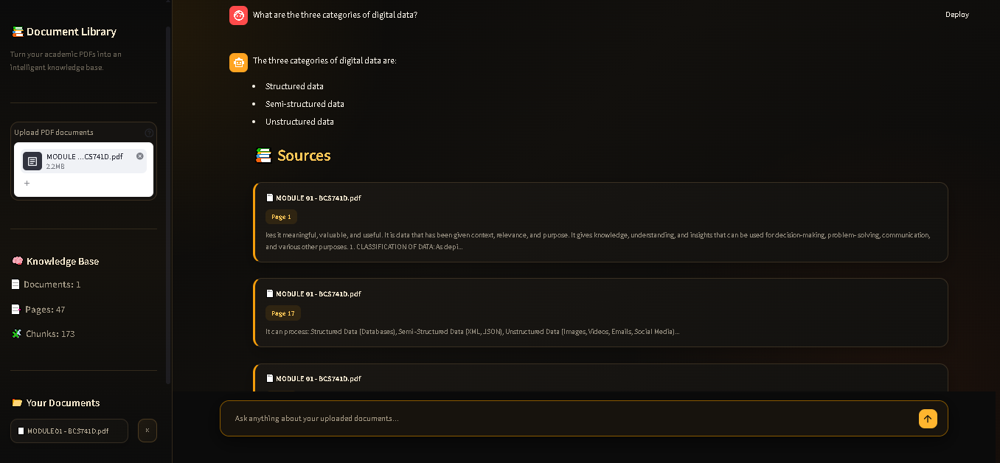
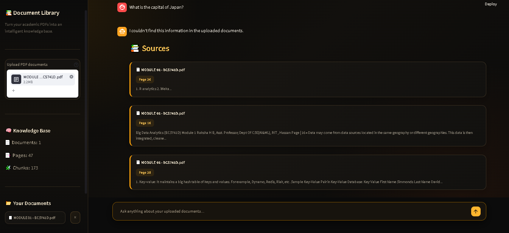

# 🧠 DocuMind AI — Academic Knowledge & Student Assistant

DocuMind AI is a domain-specific **Retrieval-Augmented Generation (RAG) chatbot** that allows students to upload academic PDF documents and ask questions about their content.

Instead of relying only on general AI knowledge, DocuMind AI retrieves relevant information from the uploaded documents and generates answers grounded in that content.

---

## 🎯 Project Objective

The main objective of DocuMind AI is to provide students with an intelligent document-based learning assistant that can:

- Upload one or multiple academic PDFs
- Extract text from PDF documents
- Divide documents into smaller chunks
- Convert text into vector embeddings
- Store embeddings using FAISS
- Retrieve relevant information for a question
- Generate answers using an LLM
- Display document and page references
- Avoid generating unsupported information

---

## 🚀 Key Features

### 📚 Multi-PDF Upload
Users can upload multiple academic PDF documents and create a searchable knowledge base.

### ✂️ Intelligent Text Chunking
Extracted document text is divided into smaller overlapping chunks for effective retrieval.

### 🔎 Semantic Search
Sentence Transformers convert document chunks and user questions into embeddings for similarity-based retrieval.

### ⚡ FAISS Vector Search
FAISS is used to efficiently search for the most relevant document chunks.

### 🤖 Grounded AI Answers
Retrieved document content is provided to the LLM so that answers are generated using the uploaded knowledge base.

### 📄 Source References
Answers are accompanied by the relevant document name and page number.

### 🛡️ Hallucination Prevention
If the required information cannot be found in the uploaded documents, the system avoids inventing an answer.

### 💬 Interactive Chat Interface
Students can naturally ask multiple questions through the Streamlit chat interface.

### 🗂️ Knowledge Base Management
Users can view uploaded documents, page counts and indexed chunks, and remove documents when required.

---

## 🏗️ System Architecture

```text
        ┌──────────────────────┐
        │      PDF Upload      │
        └──────────┬───────────┘
                   ↓
        ┌──────────────────────┐
        │   Text Extraction    │
        │        pypdf         │
        └──────────┬───────────┘
                   ↓
        ┌──────────────────────┐
        │   Text Chunking      │
        └──────────┬───────────┘
                   ↓
        ┌──────────────────────┐
        │ Sentence Transformer │
        │     Embeddings       │
        └──────────┬───────────┘
                   ↓
        ┌──────────────────────┐
        │    FAISS Index       │
        └──────────┬───────────┘
                   │
                   │
        User Question
                   ↓
        ┌──────────────────────┐
        │   Query Embedding    │
        └──────────┬───────────┘
                   ↓
        ┌──────────────────────┐
        │ Similarity Search    │
        └──────────┬───────────┘
                   ↓
        ┌──────────────────────┐
        │ Relevant Top-K       │
        │      Chunks          │
        └──────────┬───────────┘
                   ↓
        ┌──────────────────────┐
        │      Groq LLM        │
        └──────────┬───────────┘
                   ↓
        ┌──────────────────────┐
        │ Grounded Answer +    │
        │ Document/Page Source │
        └──────────────────────┘
🛠️ Technologies Used
Technology	Purpose
Python	Core programming language
Streamlit	Web application interface
pypdf	PDF text extraction
Sentence Transformers	Text embeddings
FAISS	Vector similarity search
NumPy	Numerical operations
Groq	Large Language Model API
PyTorch	Deep learning framework
python-dotenv	Environment variable management
📂 Project Structure
DocuMind-AI/
│
├── app.py
├── rag_pipeline.py
├── document_loader.py
├── vector_store.py
├── prompt.py
│
├── requirements.txt
├── README.md
├── .gitignore
├── .env
│
├── documents/
├── vector_store/
├── tests/
└── assets/
⚙️ Installation
1. Clone the Repository
git clone YOUR_GITHUB_REPOSITORY_URL
cd DocuMind-AI
2. Create Virtual Environment
python -m venv venv
3. Activate Virtual Environment

For Command Prompt:

venv\Scripts\activate
4. Install Dependencies
pip install -r requirements.txt
🔑 Groq API Key Setup

Create a .env file in the project root:

GROQ_API_KEY=your_api_key_here

Do not upload the .env file to GitHub.

The API key is kept private using .gitignore.

▶️ Run the Application

Start the Streamlit application using:

streamlit run app.py

The application will open in your browser.

📖 How to Use
Step 1

Open DocuMind AI.

Step 2

Upload one or more academic PDF documents.

Step 3

Wait for the documents to be processed and indexed.

Step 4

Enter a question related to the uploaded documents.

Step 5

DocuMind AI retrieves the most relevant document chunks.

Step 6

The retrieved information is sent to the LLM.

Step 7

The system displays:

AI-generated answer
Source document
Relevant page number
Source content preview
🧪 Testing

The application was tested using:

Questions whose answers exist in uploaded documents
Questions requiring specific document information
Questions whose answers are not available in the uploaded documents

The system is designed to provide grounded responses and avoid unsupported answers.

🔐 Privacy & Security
API keys are stored in environment variables.
.env is excluded from GitHub using .gitignore.
Uploaded documents are used as the knowledge source for retrieval.
The chatbot is designed to answer based on retrieved document content.
🎓 Academic Use

DocuMind AI can be used by students for:

Subject notes
Academic textbooks
Study materials
College documentation
Technical PDFs
Revision and question answering
👨‍💻 Project

DocuMind AI — Academic Knowledge & Student Assistant

A domain-specific RAG chatbot developed as an academic internship major project.

📌 Future Enhancements

Possible future improvements include:

Conversation memory
Multiple knowledge-base collections
Document summarization
User feedback system
Improved retrieval ranking
Support for additional document formats
Deployment as a cloud application

## 📸 Project Screenshots

### 🏠 DocuMind AI — Home Interface



### 💬 Document-Grounded Question Answering



### 📚 Retrieved Sources with Page References



### 🚫 Out-of-Document Question Handling

