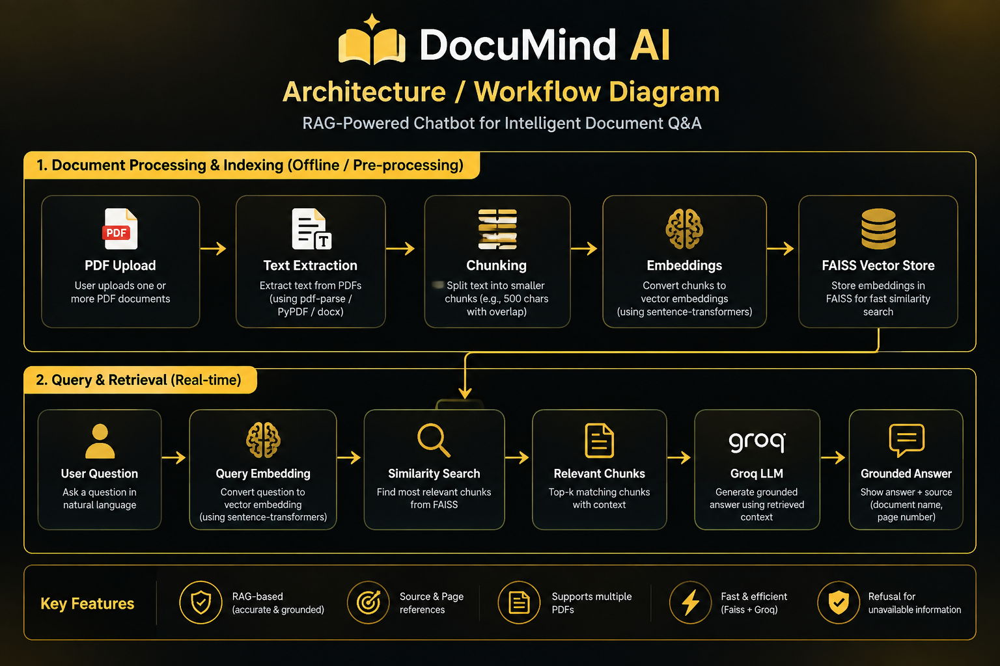

# 🧠 DocuMind AI

### Academic Knowledge & Student Assistant

DocuMind AI is a domain-specific **Retrieval-Augmented Generation (RAG) chatbot** designed to answer questions from uploaded academic PDF documents.

It combines PDF text extraction, semantic embeddings, FAISS vector search, and a Groq-powered Large Language Model to provide **document-grounded answers with source document and page references**.

---

## ✨ Features

- 📄 Upload one or multiple academic PDF documents
- 🔍 Extract text from PDF pages
- ✂️ Split documents into searchable knowledge chunks
- 🧠 Generate semantic embeddings using Sentence Transformers
- ⚡ Perform fast similarity search using FAISS
- 💬 Ask natural-language questions about uploaded documents
- 🤖 Generate grounded answers using a Groq-powered LLM
- 📚 Display source documents and page references
- 🚫 Avoid unsupported answers when information is not available
- 🗂️ Manage multiple uploaded documents
- 🧹 Clear the knowledge base when required
- 🎨 Professional dark gold/orange Streamlit interface

---

## 🏗️ System Architecture

```text
PDF Documents
      ↓
Text Extraction
      ↓
Text Chunking
      ↓
Sentence Transformer Embeddings
      ↓
FAISS Vector Database
      ↓
User Question
      ↓
Semantic Similarity Search
      ↓
Top Relevant Chunks
      ↓
Groq LLM
      ↓
Grounded Answer + Source References
```
### Architecture Diagram


---

## 🛠️ Technologies Used

| Technology | Purpose |
|---|---|
| Python | Core programming language |
| Streamlit | Web application interface |
| PyPDF | PDF text extraction |
| Sentence Transformers | Semantic text embeddings |
| FAISS | Vector similarity search |
| NumPy | Numerical processing |
| Groq | Large Language Model |
| python-dotenv | Environment variable management |

---

## 📁 Project Structure

```text
DocuMind-AI/
│
├── assets/
│   ├── home.png
│   ├── question-answer.png
│   ├── multiple-sources.png
│   └── refusal-test.png
│
├── app.py
├── document_loader.py
├── rag_pipeline.py
├── requirements.txt
├── README.md
└── .gitignore
```

---

## ⚙️ Installation

### 1. Clone the Repository

```bash
git clone https://github.com/Shashank6742/DocuMind-AI.git
cd DocuMind-AI
```

### 2. Create a Virtual Environment

```bash
python -m venv venv
```

### 3. Activate the Virtual Environment

For Command Prompt:

```bash
venv\Scripts\activate
```

### 4. Install Required Packages

```bash
pip install -r requirements.txt
```

---

## 🔑 Groq API Configuration

Create a `.env` file in the project folder.

Add your Groq API key:

```text
GROQ_API_KEY=your_api_key_here
```

### Important

Do not upload the `.env` file to GitHub.

The `.gitignore` file is configured to exclude the API key and virtual environment from version control.

---

## ▶️ Run the Application

Start the Streamlit application using:

```bash
streamlit run app.py
```

The application will open in your browser.

---

## 💡 How to Use

1. Launch **DocuMind AI**.
2. Upload one or more academic PDF documents.
3. The application extracts and processes the document text.
4. The extracted content is divided into searchable chunks.
5. Sentence Transformers generate semantic embeddings.
6. The embeddings are stored and searched using FAISS.
7. Enter a question related to the uploaded documents.
8. DocuMind AI retrieves the most relevant information.
9. The Groq-powered LLM generates a grounded response.
10. Source documents and page references are displayed with the answer.
11. If the requested information is not available, the system informs the user instead of inventing an answer.

---

## 🧪 Testing

The application was tested using both document-related questions and questions outside the uploaded document content.

### Test 1 — Document-Based Question

**Question:**

> What is Big Data?

The system retrieves relevant information from the uploaded academic document and generates a grounded answer with source references.

---

### Test 2 — Classification Question

**Question:**

> What are the three categories of digital data?

The system identifies the relevant document sections and displays the answer with source and page references.

---

### Test 3 — Out-of-Document Question

**Question:**

> What is the capital of Japan?

Since the information is not available in the uploaded academic document, the system responds that the information could not be found instead of generating an unsupported answer.

This demonstrates the document-grounding and refusal behavior of the RAG system.

---

## 📸 Project Screenshots

### 🏠 Home Interface

The main interface provides PDF upload, knowledge-base statistics, document management, and the DocuMind AI chat interface.


---

### 💬 Document-Grounded Question Answering

The chatbot retrieves relevant information from the uploaded academic document and generates a grounded answer.


---

### 📚 Multiple Sources and Page References

The system can retrieve relevant information from multiple document sections and display the corresponding source documents and page references.


---

### 🚫 Out-of-Document Question Handling

When the requested information is not available in the uploaded documents, DocuMind AI avoids generating an unsupported answer.


---

## 🔒 Privacy and Security

- API keys are stored using environment variables.
- `.env` is excluded from version control.
- Uploaded documents are processed for the application's knowledge base.
- The chatbot is designed to ground answers in the uploaded documents.
- The system is designed to avoid generating answers that are unsupported by retrieved document content.

---

## 🚀 Future Enhancements

- 🧠 Conversation memory
- 📚 Multiple knowledge-base collections
- 📝 Document summarization
- 👍 User feedback system
- 🔎 Improved retrieval ranking
- 📄 Support for additional document formats
- ☁️ Cloud deployment
- 📊 Retrieval and answer analytics
- 🎓 Subject-wise academic knowledge bases

---

## 🎓 Academic Project

**Project:** DocuMind AI — Academic Knowledge & Student Assistant

**Domain:** Artificial Intelligence / Natural Language Processing / Retrieval-Augmented Generation

**Application:** Domain-specific question answering from academic PDF documents

**Interface:** Streamlit

**Vector Search:** FAISS

**Embedding Model:** Sentence Transformers

**LLM:** Groq

---

## 👨‍💻 Developer

**Shashank BH**

B.E. Computer Science and Engineering (AI & ML)

---

## ⭐ Project Highlights

DocuMind AI demonstrates the complete workflow of a modern Retrieval-Augmented Generation system:

**Upload → Extract → Chunk → Embed → Index → Retrieve → Generate → Cite**

The project focuses on providing reliable answers from user-provided academic documents rather than relying only on general-purpose AI knowledge.

---